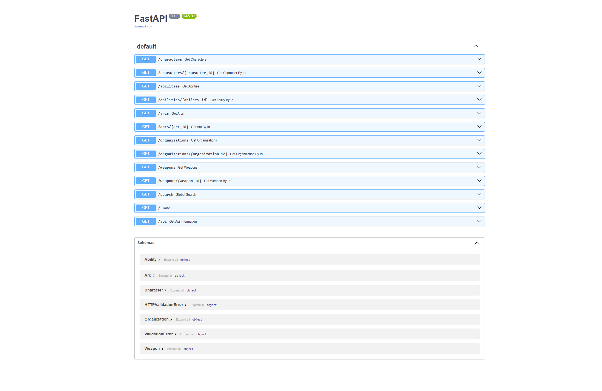

# Soul Eater API Deployment

## Overview

The Soul Eater API is a full-stack application deployed on an ubuntu server virtual machine running in my Proxmox homelab.

The application is containerized using Docker and managed with Docker Compose. The deployment is made up of a Next.js frontend, FastAPI backend, PostgreSQL database, and Nginx reverse proxy.

Nginx acts as the main entry point for the application, routes frontend requests to the Next.js container and API requests to the FastAPI container. The FastAPI backend takes application data from PostgreSQL, which uses persistent storage to preserve data separately from the database container.

## Architecture

The Soul Eater API is deployed using four Docker containers:

- **Nginx container**: runs Nginx as a reverse proxy to send requests to the correct container.
- **Frontend container**: runs the Next.js frontend of the application.
- **Backend container**: runs the FastAPI backend and handles API requests.
- **PostgreSQL container**: runs the PostgreSQL database that stores the API data.

Docker Compose is used to run and manage all four of the containers together.

### Request Flow

Nginx is the main entry point to the application. When a request comes in, Nginx decides where it needs to go.

Requests for the website are sent to the Next.js frontend and requests that start with `/api/` are sent to the FastAPI backend.

When the backend needs data, it connects to PostgreSQL and retrieves the requested information.

```text
Client
  |
  |
  |--> Nginx :8080
        |
        |-- / ---------> Frontend Container (Next.js :3000)
        |
        |-- /api/ ----> Backend Container (FastAPI : 8000) --> PostgreSQL Container : 5432
```

## Technology Stack

The Soul Eater deployment uses:

- **Proxmox VE** to run the Ubuntu Server virtual machine.
- **Ubuntu Server** as the operating system hosting the Docker environment.
- **Docker** to run each part of the application in separate containers.
- **Docker Compose** to manage the containers together.
- **Next.js** for the frontend.
- **FastAPI** for the backend API.
- **PostgreSQL** for application data.
- **Nginx** as the reverse proxy.

## Deployment Environment

The application is hosted on an Ubuntu Server virtual machine running inside Proxmox on my homelab server. The frontend, backend, PostgreSQL database and the Nginx reverse proxy all run as Docker containers on the Ubuntu VM.

## Testing

After deploying the application, I tested the FastAPI endpoints using Swagger UI to confirm that the backend was running correctly and could return the Soul Eater data.

The frontend was also tested through the Nginx reverse proxy to confirm that the requests could reach the frontend and API through the same entry point.

